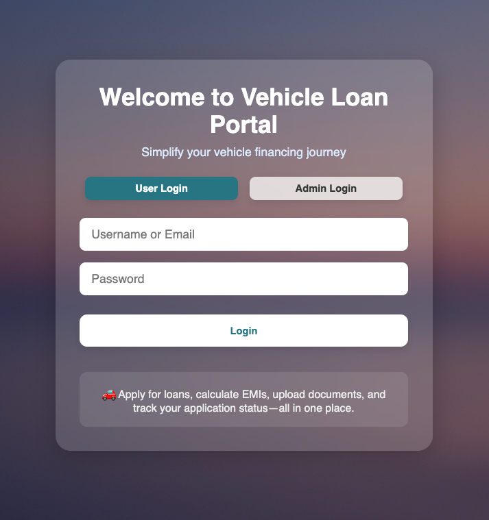
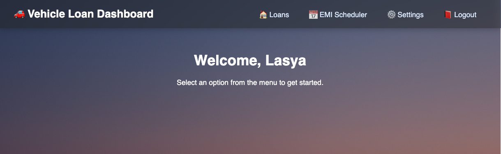
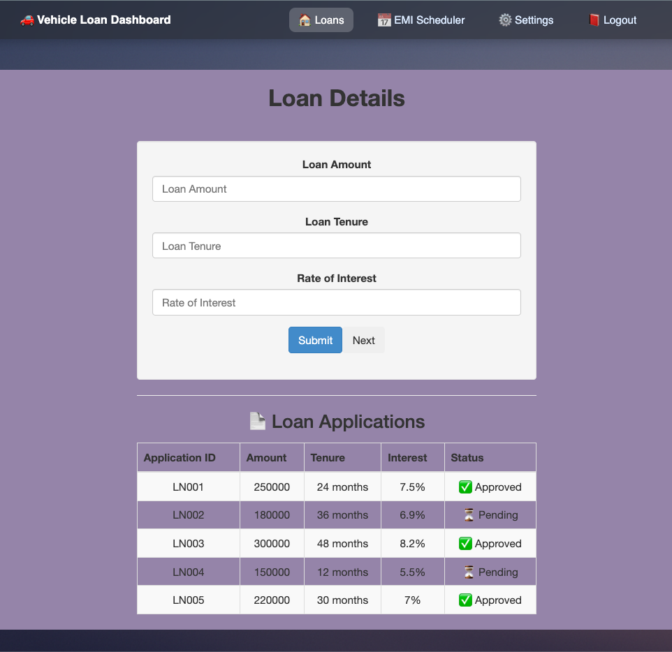

# 🚀 Vehicle Loan Application Tracker

A responsive, modular Angular application streamlining the loan application lifecycle. Designed to simplify the borrowing experience and provide end-to-end control for both users and administrators.

## 📖 Project Overview

The **Vehicle Loan System** is designed to automate and optimize the loan journey for applicants and administrators alike. It eliminates paperwork, minimizes approval delays, and brings clarity to financial decisions by integrating loan application, EMI estimation, document handling, and admin control into one user-friendly platform.

## 🎯 Key Features

- 🔐 **User Authentication**: Secure user/admin login system  
- 📝 **Loan Application Module**: Apply with personal, employment, and vehicle details  
- 📊 **EMI Calculator**: Real-time calculation of monthly installments  
- 📁 **Document Upload & Tracking** *(Planned)*  
- 🧑‍💼 **Admin Dashboard**: Review applications, approve/reject loans  
- 📈 **Data from JSON Mock API**: Sample data fetched from `assets/sample-loans.json`

## 🧩 Modules Breakdown

### 👥 User Module
- Register/Login as a user  
- Fill in loan details & submit application  
- Use EMI calculator  
- View application status  

### 🛠️ Admin Module
- Login as admin  
- Review submitted applications  
- Approve/Reject based on verification  
- View and manage loan data  

## 📸 Preview

### 🔐 Login Page


### 🏠 User Dashboard


### 🧾 Admin Loan Details View


## 🛠️ Tech Stack

| Layer        | Technology        |
|--------------|-------------------|
| Frontend     | Angular 16        |
| UI/Styling   | Bootstrap 3, SCSS |
| Routing      | Angular Router    |
| Data Handling| `HttpClient`, JSON APIs |
| Dev Tools    | VSCode, Angular CLI |

## 📁 Folder Highlights

```bash
src/
├── app/
│   ├── login/                  # Login UI for user/admin
│   ├── user-dashboard/         # User view with nested routes
│   ├── loandetailapplicationn/ # Loan table + logic
│   ├── emi-calculator/         # EMI calculation logic
│   └── dummy-settings/         # Placeholder settings module
└── assets/
    └── sample-loans.json       # Mock data source
